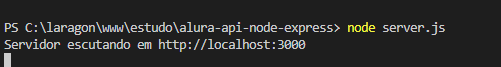

# Introdução de uma API REST básica em Node.js com Express

## Comunicação Stateless

Comunicação sem estado, ou seja, quando eu devolvo uma resposta, aquele é o valor no momento da requisição. Se 2 segundos depois o valor dela mudar, para você o valor continua o mesmo.

## 1. Preparação do Ambiente

Para fazer esta aplicação, vamos precisar do Node.js de preferencia versão 16.14 ou superior. Para realizar a instalação é só ir até o site, [nodejs.org](https://nodejs.org/en/).

## 2. Inicializando o projeto Node usando o modulo Nativo do Node

Crie no seu ambiente de diretórios uma pasta para o seu projeto, e no terminal vamos iniciar nossa aplicação com o comando abaixo no terminal para ele iniciar nosso ambiente já setando o padrão para todas as perguntas:

```jsx
npm init -y
```

### 2.1 Criando um servidor local

Para podermos executar nossa aplicação vamos criar um servidor local. Para isso, na sua pasta, você irá criar um arquivo com o nome `server.js.`

Neste arquivos vamos digitar o seguinte código:

```jsx
//Criando uma constante que vamos usar o módulo nativo HTTP
const http = require("http")
// Definindo a porta que nosso servidor vai escutar
const port = 3000

//Criando o Servidor e definindo como ele vai funcionar, com as requisições e as respostas assim como as funcoes que vao acontecer nele
const server = http.createServer((req, res) => {
    //Definindo o Cabeçalho como texto
    res.writeHead(200,{'Content-type':'text/plain'})
		//Definindo a resposta que será exibida
    res.end('Curso de Node')
})

//Quando nosso servidor for executado ele irá mostrar a seguinte mensagem
server.listen(port,()=>{
    console.log(`Servidor escutando em http://localhost:${port}`)
})
```

Para executar nosso servidor vamos executar o comando abaixo no terminal

```jsx
node server.js
```

Ele irá então exibir a mensagem e já nos dará o link para acessarmos nosso servidor.



Se acessarmos o link veremos a seguinte resposta:


### 2.2 Adicionando o serviço de rotas

Vamos para a execução do nosso servidor dando o comando CTRL+C no terminal e vamos adicionar no arquivo do nosso servidor a criação das nossas rotas através de uma constante rotas

Altere o arquivo `server.js` para o seguinte código:

```jsx
//Criando uma constante que vamos usar o módulo nativo HTTP
const http = require("http")
// Definindo a porta que nosso servidor vai escutar
const port = 3000

// Vamos criar aqui as nossas Rotas
const rotas = {
    '/' : 'Curso de node',
    '/livros' : 'Entrei na pagina de livros',
    '/autores': 'Entrei na pagina de Autores'
}

//Criando o Servidor e definindo como ele vai funcionar, com as requisições e as respostas assim como as funcoes que vao acontecer nele
const server = http.createServer((req, res) => {
    //Definindo o Cabeçalho como texto
    res.writeHead(200,{'Content-type':'text/plain'})

    //Agora vamos trocar a resposta para exibir exatamento o que foi criado na nossa rota
    //Dependendo do que vier na url ele vai retornar algo da nossa constante
    res.end(rotas[req.url])
})

//Quando nosso servidor for executado ele irá mostrar a seguinte mensagem
server.listen(port,()=>{
    console.log(`Servidor escutando em http://localhost:${port}`)
})
```

Após definir salve o arquivo e execute novamente o servidor com o comando `node server.js` 

Dessa maneira, ao acessar o nosso navegador com as seguintes rotas vamos ter as respostas de acordo com nossas rotas, conforme podemos ver nas imagens abaixo.


### 2.3 Instalando o Nodemon para livereload do servidor

Para nosso servidor atualizar automaticamente de acordo com as alterações que fizermos nos arquivos vamos usar uma biblioteca chamada nodemon.

Vamos parar nosso servidor, e seguir com a instalação da biblioteca apenas na dependência de desenvolvimento. No terminal entre com o seguinte código:

```jsx
npm install nodemon@2.0.15 -D
```

Agora para usarmos o nodemon, vamos alterar nosso arquivo `package.json` para inserir o script de uso do nodemon.

No local dos scripts iremos acrescentar a seguinte linha de dev:

```jsx
"scripts": {
    "dev" : "nodemon server.js",
    "test": "echo \"Error: no test specified\" && exit 1"
  },
```

A linha dev irá rodar o script do nodemon e agora para executarmos nossa aplicação precisamos apenas digitar o comando:

```jsx
npm run dev
```

Agora ao alterarmos nosso arquivo `server.js` nosso servidor vai atualizar automaticamente reconhecendo as alterações.

Para ver isso, adicione as rotas abaixo no arquivo `server.js` e abra o navegador tentando acessá-las.

```jsx
const rotas = {
    '/' : 'Curso de node',
    '/livros' : 'Entrei na pagina de livros',
    '/autores': 'Entrei na pagina de Autores',
    '/editora': 'Entrei na pagina de editoras',
    '/sobre':'Info sobre o projeto'
}
```


## 3. Criando uma API Node usando o Framework Express

Vamos parar nosso servidor e adicionar o Express através do comando abaixo:

```jsx
npm install express@4.17.3
```

Preparando nossa aplicação para as boas práticas vamos criar uma pasta `src` e dentro dela um arquivo `app.js`


### 3.1 Criando uma rota de requisição de dados (GET)

No nosso arquivo `app.js` vamos criar dois métodos para ver nosso servidor funcionando. Neste começo vamos criar um método GET para ler todos nossos livros.Nosso arquivo ficará assim:

```jsx
// Importando o Express
import express from "express";

// Criando uma instancia do express para poder utilizar
const app = express();

// Para vermos no nosso projeto inicial alguns dados de roda vamos criar uma constante de livros
const livros = [
    {id: 1, "titulo": "Senhor dos aneis"},
    {id: 2, "titulo": "O Hobbit"}
]

//Criando a rota GET base
app.get('/', (req,res) => {
    //Enviando uma resposta 200 com o texto Curso de Node
    res.status(200).send('Curso de Node')
})

app.get('/livros', (req,res) =>{
    //Enviando uma resposta 200 com o valor da constante livros
    res.status(200).json(livros)
})

//Exportando o arquivo para fazer uso dele no server
export default app
```

Para trabalharmos com importação e exportação de arquivo precisamos alterar nosso arquivo `package.json` com o “type”:”module”. Para isso adicione no seu arquivo para ficar conforme as linhas abaixo:

```jsx
  "main": "index.js",
  **"type": "module",**
  "scripts": {
    "dev": "nodemon server.js",
    "test": "echo \"Error: no test specified\" && exit 1"
  },
```

Agora vamos alterar nosso arquivo `server.js` para utilizar o express. Vamos manter apenas as linhas abaixo em nosso arquivo:

```jsx
// Importando o arquivo app.js
import app from "./src/app.js"

// Setando para uso da porta do arquivo ENV ou 3000
const port = process.env.PORT || 3000

// Setando nosso arquivo APP para ser ouvido pelo servidor
app.listen(port,()=>{
    console.log(`Servidor escutando em http://localhost:${port}`)
})
```

Agora para testarmos nosso servidor vamos rodar o `npm run dev` no terminal.

Abrindo nossas rotas `/` e `/livros` vamos ver as respostas no nosso navegador.


### 3.2 Criando uma rota de inserção de livro (POST)

Vamos agora criar uma rota Post no nosso arquivo `app.js` para adicionar um novo livro e ao mesmo tempo vamos definir no nosso arquivo uma nova biblioteca ( express.json() ) que nos ajudará a entender a requisição de JSON. Para isso iremos adicionar a linha abaixo da linha da const app e a nova rota post abaixo das rotas get que ja criamos.

```jsx
// Criando uma instancia do express para poder utilizar
const app = express();

//Setando a biblioteca para reconhecer a entrada de requisição em Json
app.use(express.json());
```

```jsx
app.post('/livros',(req,res)=>{
    //Adicionando na array livros o corpo que for enviado na rota
    livros.push(req.body);
    //Enviando status e mensagem de sucesso no cadastro 
    res.status(201).send('Livro Cadastrado com sucesso.')
})
```

Ao final nosso arquivo inteiro ficará assim:

```jsx
// Importando o Express
import express from "express";

// Criando uma instancia do express para poder utilizar
const app = express();

//Setando a biblioteca para reconhecer a entrada de requisição em Json
app.use(express.json());

// Para vermos no nosso projeto inicial alguns dados de roda vamos criar uma constante de livros
const livros = [
    {id: 1, "titulo": "Senhor dos aneis"},
    {id: 2, "titulo": "O Hobbit"}
]

//Criando a rota GET base
app.get('/', (req,res) => {
    //Enviando uma resposta 200 com o texto Curso de Node
    res.status(200).send('Curso de Node')
})

app.get('/livros', (req,res) =>{
    //Enviando uma resposta 200 com o valor da constante livros
    res.status(200).json(livros)
})

app.post('/livros',(req,res)=>{
    //Adicionando na array livros o corpo que for enviado na rota
    livros.push(req.body);
    //Enviando status e mensagem de sucesso no cadastro 
    res.status(201).send('Livro Cadastrado com sucesso.')
})

//Exportando o arquivo para fazer uso dele no server
export default app
```

Lembrando que toda vez que salvamos nossa aplicação nosso servidor é reiniciado e como não estamos armazenando registros em banco de dados ainda temos que inserir novamente os registros para alterar.

Para utilizar esta rota anterior iremos utilizar o insominia para enviar as solicitações. Então teremos no nosso insominia a seguinte rota POST


Com esta rota conseguimos inserir um novo registro, para visualizar este registro podemos utilizar a rota GET que criamos para observar.


### 3.3 Criando uma rota de atualização (PUT)

Vamos criar uma rota de atualização de dados agora utilizando o método PUT. Para isso vamos criar a rota e a função a seguir:

```jsx
// Criando a rota de atualização passando id através do :id
app.put('/livros/:id',(req,res)=>{
    //Buscando a partir da id passada no parametro da requisicao
    let index = buscaLivro(req.params.id)
    //Substituindo o titulo da array pelo que veio no corpo da requisicao
    livros[index].titulo = req.body.titulo
    //Retornando a array completa na resposta. Por padrão o status é o 200
    res.json(livros)
})

//Criando uma função para buscar o item a partir de uma id
function buscaLivro(id){
    return livros.findIndex(livro => livro.id == id)
}
```

Lembrando que toda vez que salvamos nossa aplicação nosso servidor é reiniciado e como não estamos armazenando registros em banco de dados ainda temos que inserir novamente os registros para alterar.

Para utilizar esta rota anterior iremos utilizar o insominia para enviar as solicitações. Então teremos no nosso insominia a seguinte rota PUT. Iremos alterar o id 3 com o seguinte titulo definido no corpo JSON.


### 3.4 Criando uma rota de busca especifica por um ID (GET)

Iremos agora embaixo das rotas de GET criar uma rota para buscar um id especifico. Nossa rota irá ficar muito parecida com a rota de PUT que fizemos com a diferença que desta vez não vamos alterar nenhum registro e no final vamos mostrar apenas o livro especifico buscado pelo ID. Veja como ficará nossa rota GET.

```jsx
// Criando a rota de busca de um livro especifico pelo parametro :id
app.get('/livros/:id',(req,res)=>{
    //Buscando a partir da id passada no parametro da requisicao
    let index = buscaLivro(req.params.id)
    //Retornando a array completa do ID especificado. Por padrão o status é o 200
    res.json(livros[index]) 
})
```

Para buscarmos o livro iremos usar o insomnia e podemos enviar a seguinte requisição.


### 3.5 Criando uma rota de exclusão (DELETE)

Abaixo da nossa função de busca de livro vamos inserir uma nova rota agora com o método DELETE. Esta rota irá remover um livro especifico e para isso nossa rota ficará assim:

```jsx
// Criando a rota de exclusão passando id através do :id
app.delete('/livros/:id',(req,res)=>{
    //Com a atribuição via desestruturação do javascript podemos fazer o seguinte para recuperar o id
    let {id} = req.params
    //Buscando a partir da id passada no parametro da requisicao
    let index = buscaLivro(id)
    //Excluindo o livro atraves do metodo splice. setando o inicio da exclusão e quantos itens vamos excluir
    livros.splice(index,1)
    //Retornando a mensagem de exclusão realizada com sucesso
    res.send(`Livro ${id} removido com sucesso!`) 
})
```

Após realizarmos esta rota, podemos testar no insomnia realizando a seguinte requisição para excluir o livro de id 2


Após executar esta requisição podemos verificar nossos livros através do método GET para listar todos e veremos que o item 2 foi removido.


## 4. Conclusão

Ao final destes tópicos nosso arquivo app.js completo ficará assim:

```jsx
// Importando o Express
import express from "express";

// Criando uma instancia do express para poder utilizar
const app = express();

//Setando a biblioteca para reconhecer a entrada de requisição em Json
app.use(express.json());

// Para vermos no nosso projeto inicial alguns dados de roda vamos criar uma constante de livros
const livros = [
    {id: 1, "titulo": "Senhor dos aneis"},
    {id: 2, "titulo": "O Hobbit"}
]

//Criando a rota GET base
app.get('/', (req,res) => {
    //Enviando uma resposta 200 com o texto Curso de Node
    res.status(200).send('Curso de Node')
})

app.get('/livros', (req,res) =>{
    //Enviando uma resposta 200 com o valor da constante livros
    res.status(200).json(livros)
})

// Criando a rota de busca de um livro especifico pelo parametro :id
app.get('/livros/:id',(req,res)=>{
    //Buscando a partir da id passada no parametro da requisicao
    let index = buscaLivro(req.params.id)
    //Retornando a array completa do ID especificado. Por padrão o status é o 200
    res.json(livros[index]) 
})

app.post('/livros',(req,res)=>{
    //Adicionando na array livros o corpo que for enviado na rota
    livros.push(req.body);
    //Enviando status e mensagem de sucesso no cadastro 
    res.status(201).send('Livro Cadastrado com sucesso.')
})

// Criando a rota de atualização passando id através do :id
app.put('/livros/:id',(req,res)=>{
    //Buscando a partir da id passada no parametro da requisicao
    let index = buscaLivro(req.params.id)
    //Substituindo o titulo da array pelo que veio no corpo da requisicao
    livros[index].titulo = req.body.titulo
    //Retornando a array completa na resposta. Por padrão o status é o 200
    res.json(livros) 
})

//Criando uma função para buscar o item a partir de uma id
function buscaLivro(id){
    return livros.findIndex(livro => livro.id == id)
}

// Criando a rota de exclusão passando id através do :id
app.delete('/livros/:id',(req,res)=>{
    //Com a atribuição via desestruturação do javascript podemos fazer o seguinte para recuperar o id
    let {id} = req.params
    //Buscando a partir da id passada no parametro da requisicao
    let index = buscaLivro(id)
    //Excluindo o livro atraves do metodo splice. setando o inicio da exclusão e quantos itens vamos excluir
    livros.splice(index,1)
    //Retornando a mensagem de exclusão realizada com sucesso
    res.send(`Livro ${id} removido com sucesso!`) 
})

//Exportando o arquivo para fazer uso dele no server
export default app
```

Nós vimos neste tutorial como criar uma API Node.js básica com Express e livereload e como criarmos rotas de um CRUD simples, mas ainda precisamos evoluir para aplicar uma estruturação melhor e mais organizada também aplicando uma conexão com banco de dados para mantermos nossos dados persistentes.

Conteúdo criado baseado na aula de Node.js do site Alura: [Alura - Node.js](https://cursos.alura.com.br/course/nodejs-api-rest-express-mongodb). 